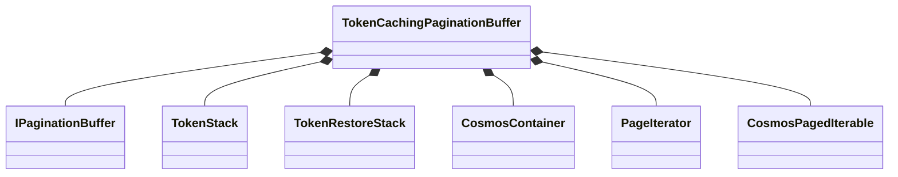

# cosmos-paginator
A bi-directional pagination library for Cosmos DB with built-in page caching
## Internal Architecture
### Class Diagram

```mermaid
classDiagram
    TokenCachingPaginationBuffer *-- IPaginationBuffer
    TokenCachingPaginationBuffer *-- TokenStack
    TokenCachingPaginationBuffer *-- TokenRestoreStack
    TokenCachingPaginationBuffer *-- CosmosContainer
    TokenCachingPaginationBuffer *-- PageIterator
    TokenCachingPaginationBuffer *-- CosmosPagedIterable
```